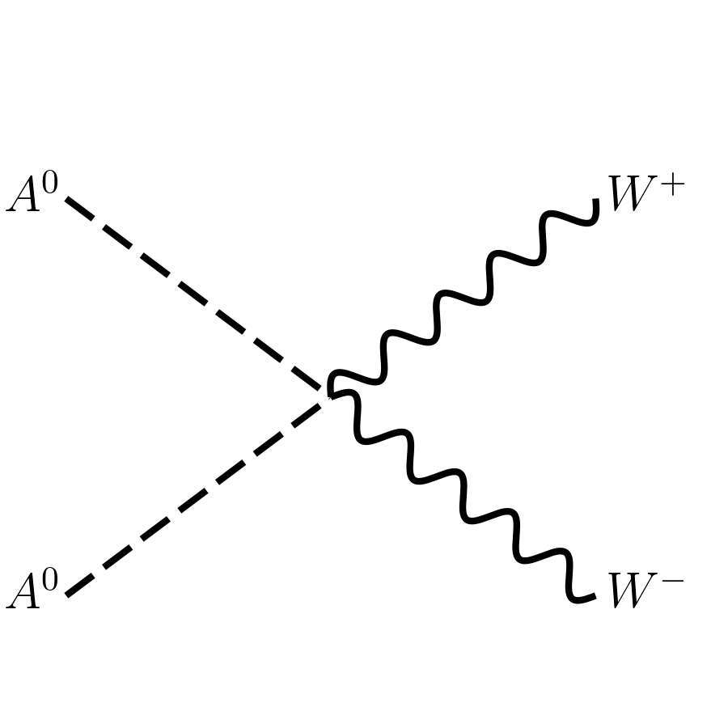
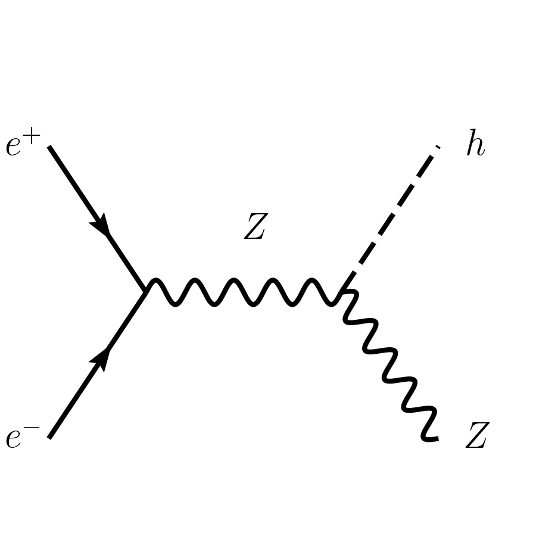
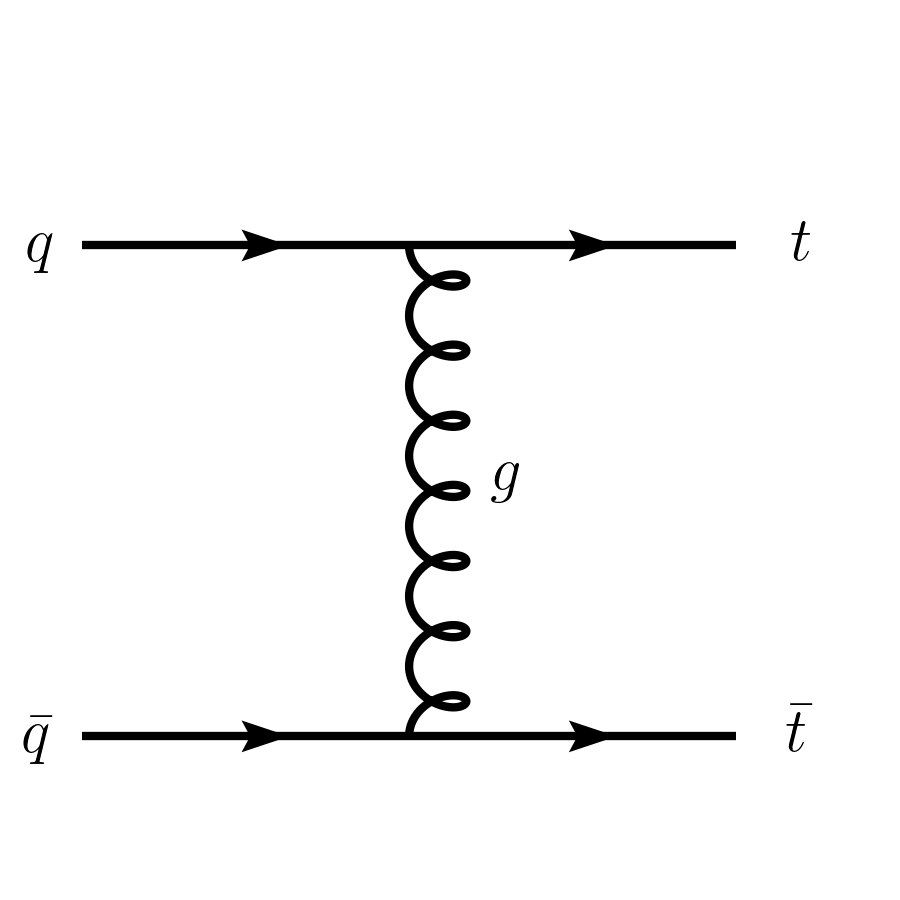
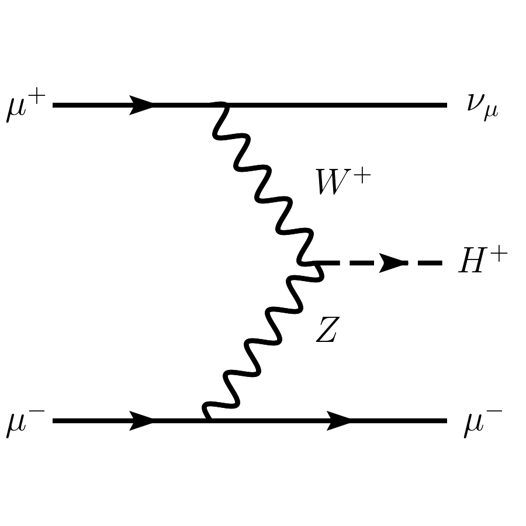
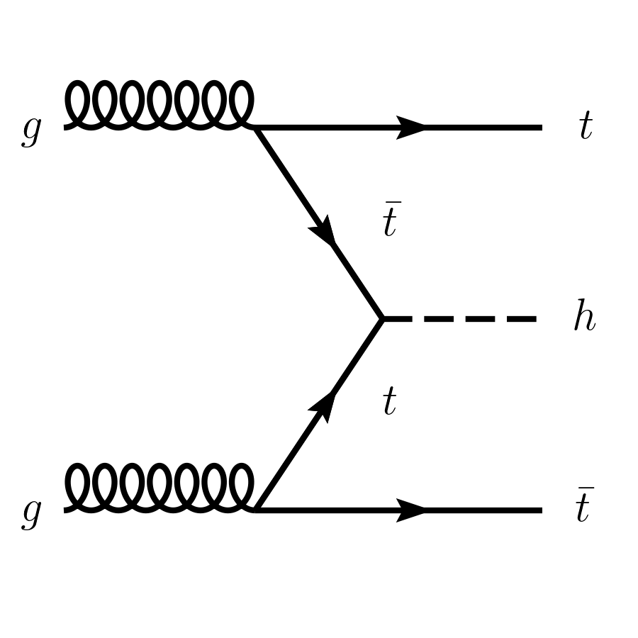

# FeynCreation

**FeynCreation** is a Python tool that allows you to generate Feynman diagrams interactively, using the `feynman` package.

## Features

- Currently has two classes of diagrams: `twotwo` that handles 2->2 processes, and `vbf1` that has VBF-type production of single particles.
- Has four-point contact annihilation, s-channel, and t-channel diagrams for `twotwo` processes.
- Uses LaTeX to render particle labels in diagrams.
- Supports customizable arrows for incoming, outgoing, and mediator particles.
- Supports interactive, card-based, and script-based generation.
- Own particles and their latex rendering can be added manually in the `particles.py` file.

## Installation

Clone the repository and install the package:

```bash
git clone git@github.com:snehashishep/feyncreation.git
cd feyncreation
pip install -e .
```

## Usage

from the package directory, in the command line, type and enter:

```bash
feyncreation
```

and follow the prompts.

- If you want to use an input card, type `yes` when prompted. Card file examples are in `examples/*_input.txt`.
- Type relative path to the card file in the prompt.
- If not using card file, choose the process class: currently we have `twotwo` and `vbf1`.
- For `twotwo`, choose `four-point`, `s-channel` or `t-channel` at the next prompt.
- Enter the basic process, like `q qbar > t tbar` for `twotwo`, `q qbar > q qbar h` for `vbf1`.
- Follow the rest of the prompts accordingly. When prompted with arrow requirement for incoming/outgoing/vector boson particles, enter the particle names separated by space.
- Lastly, enter the `filename` so that your file will be saved as `filename.png`.

For script-based usage, see `examples/*_script.py` files. Simply run the script like:

```bash
python3 examples/*_script.py
```

## Example Diagrams

### Pseudoscalar DM annihilation (`twotwo.four-point`)


### $hZ$ production from $e^+ e^-$ collision (`twotwo.s-channel`)


### $t$-channel $q\bar{q}\to t\bar{t}$ (`twotwo.t-channel`)


### VBF production of charged Scalar from $\mu^+ \mu^-$ collision (`vbf1`)


### $gg \to t\bar{t}h$ production, looks like VBF (`vbf1`)

